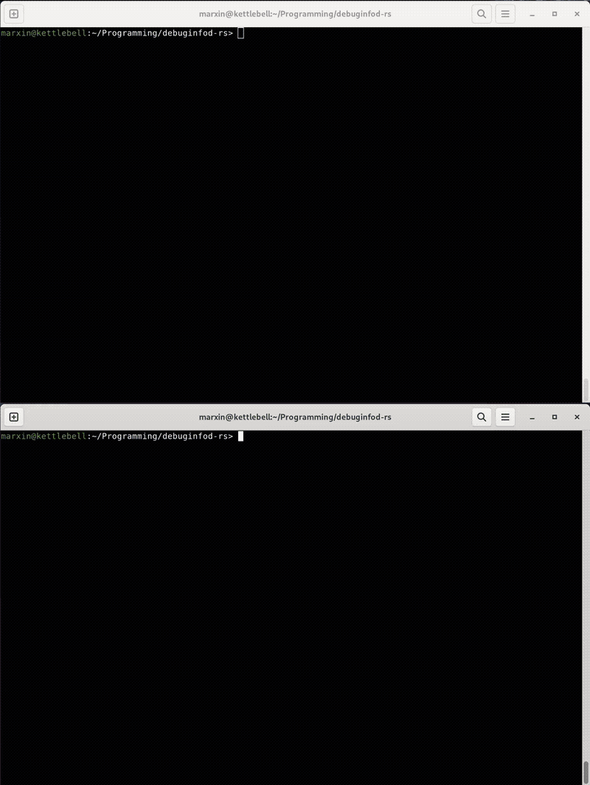

# debuginfod-rs

An extremely fast [debuginfod](https://sourceware.org/elfutils/Debuginfod.html) server, written in Rust.

```
[2023-12-13T08:35:11.001Z INFO  debuginfod_rs] walking 173017 RPM files (477.8 GB)
[2023-12-13T08:35:12.389Z INFO  debuginfod_rs] parsing took: 2.09 s (228.8 GB/s)
```

- ⚡️ ~30x faster than the elfutils' debuginfod (only RPM metadata are parsed)
- 🧵 multithreaded parser and web server
- 🦋 in-memory database (~200MiB per 1TB of the indexed RPM files)
- 📦 RPM-based only (openSUSE and Fedora/RHEL packages supported)
- 🌐 full debuginfod Web API supported
- 🗜 commonly used compressions supported (bzip2, gzip, xz, zstd)

## Implementation details

The indexer benefits from symlinks created by `rpmbuild` which link each ELF executable (and shared library)
and it's corresponding build-id path. Each web request first identifies an RPM file with a build-id and
the corresponding ELF (or source) file is extracted on demand. Grouping of the `foo-debuginfo`, `foo-debugsource`
and `foo` packages happens based on the source RPM file (present in the RPM file metadata).

The indexing speed heavily depends on the disk speed, where one can get up to ~100 GB/s
on a modern AMD CPU (for the cached IO).

## Known limitations

- missing `AsyncRead` support for RPM container visitor (content is read to memory in a web response)
- indexer does not implement elfutils' heuristics for header file requests where the file
  is part of a build-id, but it's actually present in a different RPM package
  (e.g. header files of the devel sub-packages of a library)
- missing disk cache
- missing support for other containers like `.deb`

## Example usage

.
